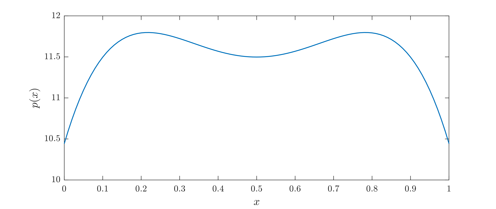

.. include:: ../substitutions.txt

Lyapunov stability of a linear PDE
================================================

Consider the partial differential equation (PDE)

.. math::

    \frac{\partial u}{\partial t} = \frac{\partial^2 u}{\partial x^2} + (k-24\,x+24\,x^2) u,

subject to the boundary conditions :math:`u(0)=0=u(1)`.

In this example we use QUINOPT to find a polynomial :math:`p(x)` of degree 4 such that the functional

.. math::

	\mathcal{V}(u) = \int_0^1 p(x)\,\vert u(x) \vert^2\, {\rm d}x

is a Lyapunov function proving the global stability of the zero solution :math:`u(x)=0` when :math:`k=15`. This means that we must find :math:`p(x)` such that, for some constant :math:`c>0`,

.. math::

    \begin{aligned}
    \mathcal{V}(u) = \int_0^1 p(x)\,\vert u(x) \vert^2\, {\rm d}x &\geq c\int_0^1 \vert u(x) \vert^2,
    \\
    -\frac{{\rm d}\mathcal V}{{\rm d}t} = \int_0^1 -2\,p(x)\,u(x)\,\frac{\partial u}{\partial t}\, {\rm d}x &\geq 0.
    \end{aligned}

Note that since both inequalities are homogeneous in :math:`p(x)`, we may without loss of generality take :math:`c=1`.

:download:`Download the MATLAB file for this example <./example05.m>`

------------------------------
1. Set up the variables
------------------------------

As usual, we start by cleaning up from previous work and defining the basic problem variables:

.. code-block:: matlabsession

    >> clear
    >> yalmip clear
    >> quinopt clear
    >> x = indvar(0,1);
    >> u = depvar(x);

Then, we set up the PDE:

.. code-block:: matlabsession

    >> k = 15;
    >> u_t = u(x,2) + (k-24*x+24*x^2)*u(x);     % the right-hand side of the PDE
    >> bc = [u(0), u(1)];                       % the boundary conditions

Finally, we define the polynomial p(x), the coefficients of which are the optimization variable. We use the command ``legpoly()`` to define a polynomial with variable coefficients in the Legendre basis (this is convenient because QUINOPT represents the variables with Legendre series expansions internally):

.. code-block:: matlabsession

	>> p = legpoly(x,4);			% Create the variable polynomial p(x)

.. note::

		The coefficients of :math:`p(x)` can be obtained using the command ``coefficients()``:

        .. code-block:: matlabsession

            >> c = coefficients(p); % c is a vector containing the variable Legendre coefficients of p

        or, more simply, by using two outputs when creating :math:`p(x)` with the command ``legpoly()``

        .. code-block:: matlabsession

            >> [p,c] = legpoly(x,4); % c is a vector containing the variable Legendre coefficients of p

--------------------------------------------------
2. Set up & solve the integral inequalities
--------------------------------------------------

To set up the inequalities in QUINOPT, simply specify their integrands as the elements of a vector ``EXPR``:

.. code-block:: matlabsession

    >> EXPR(1) = (p-1)*u(x)^2;              % \int p(x)*u(x)^2 >= \int u(x)^2
    >> EXPR(2) = -2*p*u(x)*u_t;             % -V_t(u) >=0.

To solve for p(x) and obtain some information about the solution, we use the command ``quinopt()`` with one output argument:

.. code-block:: matlabsession

    >> SOL = quinopt(EXPR,bc);

The output ``SOL`` contains information about the solution, such as the CPU time taken to set up and solve the problem. In particular,the field ``SOL.FeasCode`` indicates whether the problem was solved successfully (in this case, ``SOL.FeasCode==0``). For more information on QUINOPT's outputs and the meaning of feasibility codes, check

.. code-block:: matlabsession

    >> help quinopt
    >> quinoptFeasCode

.. note::

    It may be shown that the PDE we are analysing is unstable if :math:`k=16`. In this case, no suitable polynomial :math:`p(x)` exists, and the feasibility problem solved by QUINOPT is infeasible. This can be verified by checking the value of ``SOL.FeasCode``.

-----------------------------------
4. Plot :math:`p(x)`
-----------------------------------

Once a feasible polynomial :math:`p(x)` is found, as is the case when :math:`k=15`, one may wish to see what it looks like. MATLAB's usual ``plot()`` function is overloaded on polynomials defined with the command ``legpoly()``, making it really easy to plot :math:`p(x)`. Juse type:

.. code-block:: matlabsession

    >> xval = 0:0.01:1;          % the values of x at which p is plotted
    >> plot(xval,p)

An example of what :math:`p(x)` might look like is shown below.

.. important::

    When using ``plot()`` on a Legendre polynomial variable, the values ``xval`` must within the domain of the independent variable ``x`` originally used to define the polynomial. Otherwise, ``plot()`` throws an error. The function ``getDomain()`` can be used to check the domain over which a Legendre polynomial is defined.

`Back to Table of Contents <http://quinopt.readthedocs.io/>`_
