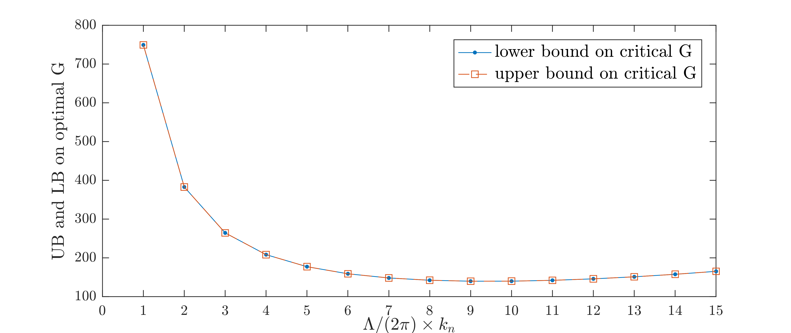

Energy stability of a stress-driven shear flow
==============================================

Consider an idealized two-dimensional layer of fluid, periodic in the horizontal (:math:`x`) direction with period :math:`\Lambda`, bounded below (:math:`y=0`) by a solid wall, and driven at the surface (:math:`y=1`) by a shear stress of non-dimensional magnitude :math:`G` (known as the *Grashoff number*).

The linear velocity profile :math:`G y\,\boldsymbol{\hat{i}}`, where :math:`\boldsymbol{\hat{i}}` is the unit vector along the :math:`x` direction, is globally stable when :math:`G` is sufficiently small. In particular it can be shown that a velocity perturbation

.. math::

    \boldsymbol{u} = u(z)\,{\rm e}^{i k_n x}\,\boldsymbol{\hat{i}}
    + v(z)\,{\rm e}^{i k_n x}\,\boldsymbol{\hat{k}} + \text{complex conjugate}

with horizontal wavenumber :math:`k_n = 2 \pi\,n/\Lambda` decays in time if

.. math::

    \begin{aligned}
    \int_0^1 &\left\{
        \frac{1}{k_n^2}\left[ \vert u''(y) \vert^2 + \vert v''(y) \vert^2\right]
        +2 \left[ \vert u'(y) \vert^2 + \vert v'(y) \vert^2\right]
        \right.
        \\
        &\qquad\qquad\qquad
        \left.
        + k_n^2 \left[ \vert u(y) \vert^2 + \vert w(y) \vert^2\right]
        - \frac{G}{k_n} \left[ u(y)\,v'(y) - v(y)\,u'(y) \right]
    \right\} {\rm d}y \geq 0
    \end{aligned}

for all functions :math:`u(v)` and :math:`v(y)` that satisfy the boundary conditions

.. math::

    \begin{aligned}
    u(0) &= 0, & u(1) &= 0, & u'(0)&=0, & u''(1) &= 0,\\
    v(0) &= 0, & v(1) &= 0, & v'(0)&=0, & v''(1) &= 0.\\
    \end{aligned}

This example shows how QUINOPT can be used to determine the maximum Grashoff number :math:`G` such that, for a given value of :math:`k_n`, the above stability condition is satisfied. The aim of the example is to illustrate how to define and use multiple dependent variables, and some good practices to solve optimization problems with QUINOPT using a loop.

:download:`Download the MATLAB file for this example <./example06.m>`

----------------------------------------------
1. Define some problem parameters and options
----------------------------------------------

As usual, we start by cleaning the workspace and the internal variables in YALMIP and QUINOPT

.. code-block:: matlabsession

    >> clear
    >> yalmip clear
    >> quinopt clear

We then define the horizontal period :math:`\Lambda`; in this example, we use :math:`\Lambda=6 \pi`.

.. code-block:: matlabsession

    >> lambda = 6*pi;

Furthermore, to run in silent mode we set YALMIP's option 'verbose' to 0, and we set YALMIP's 'cachesolvers' option to 1 to improve YALMIP's performance. Finally, we increase the degree of the Legendre expansion used internally by
QUINOPT to 10.

.. code-block:: matlabsession

    >> opts.YALMIP = sdpsettings('verbose',0,'cachesolvers',1);
    >> opts.N = 10;

--------------------------------------------------------------------
2. Maximize :math:`G` for a given :math:`k_n`
--------------------------------------------------------------------

Let us first consider the problem of finding the maximum Grashoff number that satisfies the integral inequality at the top of the page for the first wavenumber :math:`k_1 = 2 \pi / \Lambda`. The variable of integration :math:`y`, the dependent variables :math:`u(y)` and :math:`v(y)`, and the Grashoff number :math:`G` are defined using the commands

.. code-block:: matlabsession

    >> y = indvar(0,1);
    >> [u,v] = depvar(y);
    >> parameters G;

.. note::

    The syntax ``[u1,u2,...uN] = depvar(x)`` creates :math:`N` dependent variables ``u1``, ``u2``, ..., ``uN`` that depend on the same independent variable ``x``.

The integrand of the integral inequality at the top of the page and the boundary conditions on the dependent variables can then be set up in the usual way:

.. code-block:: matlabsession

    >> k = 2*pi/lambda;
    >> expr = ( u(y,2)^2+v(y,2)^2 )/k^2 + 2*( u(y,1)^2+v(y,1)^2 ) + k^2*( u(y)^2+v(y)^2 ) - G/k*( u(y)*v(y,1) - u(y,1)*v(y) );
    >> bc = [u(0); u(1); u(0,1); u(1,2)];              % boundary conditions on u
    >> bc = [bc; v(0); v(1); v(0,1); v(1,2)];          % boundary conditions on v

Finally, the maximum :math:`G` for which the stability condition is satisfied is computed by calling

.. code-block:: matlabsession

    >> quinopt(expr,bc,-G,opts);
    >> LB = value(G);

Note that the commands above maximize G using an inner approximation of the integral inequality (the default in QUINOPT) so the optimal value ``LB`` represents a lower bound on the "true" optimal :math:`G`. An upper bound can be computed by asking QUINOPT to use an outer approximation:

.. code-block:: matlabsession

    >> opts.method = 'outer';
    >> quinopt(expr,bc,-G,opts);
    >> UB = value(G);

------------------------------------------------------------------------
3. Maximize :math:`G` for multiple wavenumbers: using QUINOPT in a loop
------------------------------------------------------------------------

We now turn our attention to computing the maximum Grashoff number that satisfies the integral inequality at the top of the page not for a single wavenumber, but for all wavenumbers up to the maximum value :math:`k_{\rm max}`. Since the variables and the boundary conditions are the same for all values of the wavenumber :math:`k_n`, this could be achieved with the following ``while`` loop (we take :math:`k_{\rm max}=5`):

.. code-block:: matlabsession

    >> k = 0;                                   % initial dummy value for k
    >> k_max = 5;                               % maximum wavenumber to solve for
    >> n = 1;                                   % start from n=1
    >> while k<=k_max
    >>     % Set the wavenumber
    >>     k = 2*pi*n/lambda;
    >>     % Set up and solve the problem
    >>     expr = ( u(y,2)^2+v(y,2)^2 )/k^2 + 2*( u(y,1)^2+v(y,1)^2 ) + k^2*( u(y)^2+v(y)^2 ) - G/k*( u(y)*v(y,1) - u(y,1)*v(y) );
    >>
    >>     opts.method = 'inner';
    >>     quinopt(expr,bc,-G,opts);
    >>     LB(n) = value(G);
    >>     opts.method = 'outer';
    >>     quinopt(expr,bc,-G,opts);
    >>     UB(n) = value(G);
    >>     % update n for the next iteration
    >>     n = n+1;
    >> end

The upper and lower bounds obtained with QUINOPT using the lines of code above are plotted below.

.. important::
    When the number of iterations in the loop is large the build-up of internal variables in YALMIP and QUINOPT due to repeated calls to ``quinopt()`` could result in significant loss of computational performance. To avoid this, it may be better to clear YALMIP's and QUINOPT's variables after each iteration, and re-initialize them every time. For example, the ``while`` loop above would be replaced by:

    .. code-block:: matlabsession

        >> k = 0;                                   % initial dummy value for k
        >> k_max = 5;                               % maximum wavenumber to solve for
        >> n = 1;                                   % start from n=1
        >> while k<=k_max
        >>     % Set the wavenumber
        >>     k = 2*pi*n/lambda;
        >>     % Define the problem variables at the start of each iteration
        >>     y = indvar(0,1);
        >>     [u,v] = depvar(y);
        >>     parameters G;
        >>     % Set up the problem, including the boundary conditions
        >>     expr = ( u(y,2)^2+v(y,2)^2 )/k^2 + 2*( u(y,1)^2+v(y,1)^2 ) + k^2*( u(y)^2+v(y)^2 ) - G/k*( u(y)*v(y,1) - u(y,1)*v(y) );
        >>     bc = [u(0); u(1); u(0,1); u(1,2)];              % boundary conditions on u
        >>     bc = [bc; v(0); v(1); v(0,1); v(1,2)];          % boundary conditions on v
        >>     % Solve using inner and outer approximations
        >>     opts.method = 'inner';
        >>     quinopt(expr,bc,-G,opts);
        >>     LB(n) = value(G);
        >>     opts.method = 'outer';
        >>     quinopt(expr,bc,-G,opts);
        >>     UB(n) = value(G);
        >>     % Clear YALMIP's and QUINOPT's internal variables
        >>     yalmip clear
        >>     quinopt clear
        >>     % update n for the next iteration
        >>     n = n+1;
        >> end

`Back to Table of Contents <http://quinopt.readthedocs.io/>`_
