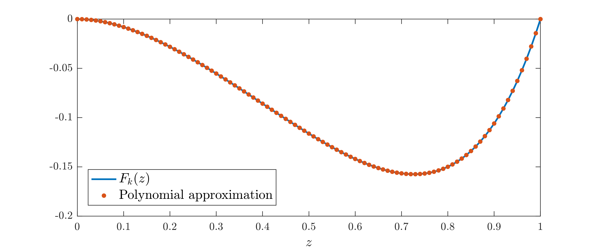

Energy stability of Bénard-Marangoni conduction at infinite Prandtl number
==========================================================================

Bénard-Marangoni convection describes the flow of a fluid layer driven by surface tension forces of magnitude described by the *Marangoni number* :math:`M`. In this example, we consider the idealized case of a unit-depth layer which is infinite in the horizontal directions, and compute the maximum :math:`M` for which the conductive state (when the fluid is at rest) is stable with respect to sinusoidal temperature perturbations with frequency magnitude :math:`k`. In particular, the *energy method* shows that conduction is stable if

.. math::

    \int_0^1 \left[
        \vert T'(z)\vert^2 + k^2 \vert T(z) \vert^2 + M\,F_k(z)\,T(z)\,T(1)
        \right] {\rm d}z \geq 0

for all functions :math:`T(z)` that satisfy the boundary conditions :math:`T(0)=0` and :math:`T'(1)=0`, where

.. math::

    F_k(z) = \frac{k\,\sinh k}{\sinh(2\,k)-2\,k} \, \left[
    k\,z\,\cosh(k\,z) - \sinh(k\,z) + (1-k\,\coth k )\,z \,\sinh(k\,z)
    \right].

For more details, see e.g. `Hagstrom & Doering, Phys. Rev. E 81, 047301 (2010) <http://dx.doi.org/10.1103/PhysRevE.81.047301>`_.

The aim of this example is to demonstrate how to solve problems in which unknown boundary values of the dependent variables appear explicitly in the integral inequality constraints. Moreover, we show how QUINOPT can be used to approximate problems with data that is non-polynomial using a truncated Legendre transform.

:download:`Download the MATLAB file for this example <./downloads/example10.m>`

----------------------------------
1. Set up the variables
----------------------------------
First, we clear the workspace, as well as QUINOPT's and YALMIP's internal variables:

.. code-block:: matlabsession

    >> clear
    >> yalmip clear
    >> quinopt clear

Then, we define the integration variable :math:`z\in[0,1]`, the dependent variable :math:`T(z)`, and the Marangoni number :math:`M`, which is the optimization variable:

.. code-block:: matlabsession

    >> z = indvar(0,1);
    >> T = depvar(z);
    >> parameters M

---------------------------------------------------------
2. Construct a polynomial approximation to :math:`F_k(z)`
---------------------------------------------------------
QUINOPT can only solve integral inequalities with polynomial data, but the function :math:`F_k(z)` is clearly not a polynomial. Yet, QUINOPT can be used if we replace :math:`F_k(z)` with a polynomial approximation of degree :math:`d`. To do so, we first construct the exact function :math:`F_k(z)` as a function handle, and we compute its first :math:`d+1` Legendre expansion coefficients using the *fast Legendre transform* command ``flt()``. Finally, we use these coefficients to build a polynomial approximation of degree :math:`d` using the command ``legpoly()``. Below, we set :math:`k=\pi` and :math:`d=10` (this gives an accurate approximation at least up to :math:`k=5`).

.. code-block:: matlabsession

    >> k = pi;
    >> d = 10;
    >> Fk = @(z)k*sinh(k)/(sinh(2*k)-2*k).*(k*z.*cosh(k*z)-sinh(k*z)+(1-k*coth(k))*z.*sinh(k*z));
    >> leg_coef = flt(Fk,d+1,[0,1]);          % Compute the Legendre expansion coefficients
    >> FkPoly = legpoly(z,d,leg_coef);        % Build a degree-d legendre polynomial with coefficients specified by leg_coef

We can easily plot both :math:`F_k(z)` and its polynomial approximation using the function ``plot()``, which is overloaded on polynomials built using ``legpoly()``:

.. code-block:: matlabsession

    >> clf;                                                     % clear current figure
    >> plot(0:0.01:1,Fk(0:0.01:1),'Linewidth',1.5); hold on;    % plot Fk(z)
    >> plot(0:0.01:1,FkPoly,'.','MarkerSize',12); hold off;     % plot the polynomial approximation
    >> xlabel('$z$','interpreter','latex','fontsize',12);
    >> legend('F_k(z)','Polynomial approximation','Location','southwest');
    >> axis([0 1 -0.2 0]);

.. note::

    The syntax ``LCOEF = flt(FUN,NCOEF,DOMAIN)`` computes the first ``NCOEF`` coefficients of the Legendre series expansion of the function specified by the function handle ``FUN`` over the interval specified by the input ``DOMAIN``. These can be used to construct a polynomial approximation to the function specified by ``FUN`` of degree ``NCOEF-1`` (recall that a polynomial of degree :math:`d` has :math:`d+1` coefficients). Note that ``DOMAIN`` should be a bounded interval in the form ``[a,b]``, and the function handle ``FUN`` should only take one input argument with values in the range specified by ``DOMAIN``.

----------------------------------------
3. Maximize :math:`M`
----------------------------------------
Once a polynomial approximation of :math:`F_k(z)` has been constructed, the maximum Marangoni number :math:`M` satisfying the integral inequality at the top of the page can be computed with QUINOPT. First, we define the integrand of the integral inequality, and the boundary conditions on the dependent variable:

.. code-block:: matlabsession

    >> EXPR = T(z,1)^2 + k^2*T(z)^2 + M*FkPoly*T(z)*T(1);
    >> BC = [T(0); T(1,1)];                                % The boundary conditions T(0)=0, T'(1)=0

Then we maximize :math:`M` by calling

.. code-block:: matlabsession

    >> quinopt(EXPR,BC,-M)
    >> value(M)

(note the negative sign in the objective function, which is needed because QUINOPT minimizes the specified objective). The optimal solution is found to be :math:`M\approx 78.55`.

----------------------------------------
4. Summary
----------------------------------------
In summary, the maximum Marangoni number :math:`M` for which a sinusoidal perturbation to the Benard-Marangoni conduction state is stable can be computed with the following lines of code:

.. code-block:: matlabsession

    >> % Clear the workspace, plus YALMIP's and QUINOPT's internal variables
    >> clear
    >> yalmip clear
    >> quinopt clear
    >> % Define the problem variables
    >> z = indvar(0,1);
    >> T = depvar(z);
    >> parameters M
    >> % Set k and build a polynomial approximation to Fk(z) of degree d=10
    >> k = pi;
    >> d = 10;
    >> Fk = @(z)k*sinh(k)/(sinh(2*k)-2*k).*(k*z.*cosh(k*z)-sinh(k*z)+(1-k*coth(k))*z.*sinh(k*z));
    >> leg_coef = flt(Fk,d+1,[0,1]);          % Compute the Legendre expansion coefficients
    >> FkPoly = legpoly(z,d,leg_coef);        % Build a degree-d legendre polynomial with coefficients specified by leg_coef
    >> % Set up and solve the optimization problem
    >> EXPR = T(z,1)^2 + k^2*T(z)^2 + M*FkPoly*T(z)*T(1);  % the integrand of the inequality
    >> BC = [T(0); T(1,1)];                                % The boundary conditions T(0)=0, T'(1)=0
    >> quinopt(EXPR,BC,-M)
    >> value(M)

----------------------

* :doc:`Back to Table of Contents <../index>`
