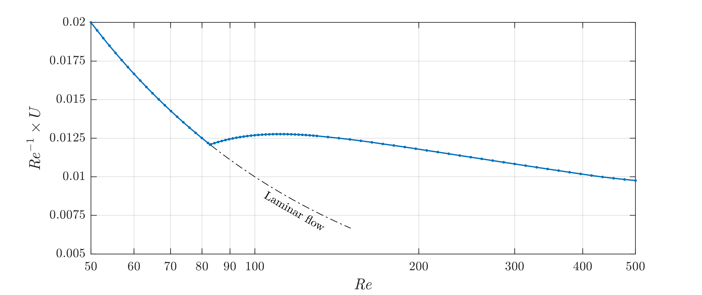

Bounds on energy dissipation for plane Couette flow
====================================================

In this example we will compute bounds on the infinite-time-and-volume-averaged energy dissipation for plane Couette flow using the *indefinite storage functional method* with a quadratic storage functional.

:download:`Download the MATLAB file for this example <./example08.m>`

.. warning::

    This example may take a few minutes to run: it took 53 seconds on a linux machine with a 3.40GHz Intel Core i7-4770 CPU, running MATLAB2016b and using MOSEK as the SDP solver. Please, do not panic if the code seems slow - this is a relatively hard example!

------------------------------
1. Description of the flow
------------------------------
Plane Couette flow describes the motion of an incompressible fluid between two horizontal parallel plates at a vertical distance of 1 unit, the top one of which moves along the :math:`x` direction with unit velocity. The system admits the steady (i.e., time independent) flow velocity field :math:`\boldsymbol{U}_l = z\,\boldsymbol{\hat{i}}`, and velocity perturbations :math:`\boldsymbol{v}=(u,v,w)` with respect to this state obey the governing equations

.. math::

    \begin{gathered}
    \frac{\partial \boldsymbol{v}}{\partial t}  = {\it Re}^{-1} \nabla^2 \boldsymbol{v} - \nabla p - (\boldsymbol{v}\cdot \nabla)\boldsymbol{v} - (\boldsymbol{v}\cdot \nabla)\boldsymbol{U}_l - (\boldsymbol{U}_l\cdot \nabla)\boldsymbol{v},
    \\
    \nabla \cdot \boldsymbol{v} = 0.
    \end{gathered}

In these equations, :math:`{\it Re}` is the Reynolds number and :math:`p` is the pressure. The boundary conditions are periodic in the horizontal directions (:math:`x` and :math:`y`) with periods :math:`\Lambda_x` and :math:`\Lambda_y`, plus

.. math::

    \boldsymbol{v}\vert_{z=0} =0,\qquad
    \boldsymbol{v}\vert_{z=1} =0.

If :math:`\Omega = [0,\Lambda_x]\times [0,\Lambda_y] \times [0,1]` is the fluid's domain, the volume-averaged energy dissipation is defined at any instant in time as

.. math::

    \begin{aligned}
    \varepsilon(t) &= \frac{1}{\Lambda_x\Lambda_y} \int_\Omega \vert \nabla \left(\boldsymbol{v} + \boldsymbol{U}_l\right)\vert^2 d\Omega.
    \\
    &= 1 + \frac{1}{\Lambda_x\Lambda_y} \int_\Omega \vert \nabla \boldsymbol{v} \vert^2 d\Omega.
    \end{aligned}

The second equality can be easily proven using integration by parts, the boundary conditions on :math:`\boldsymbol{v}`, and the definition of :math:`\boldsymbol{U}_l`.

.. note::

    We consider the equations of motion of the flow relative to the laminar flow to so the dynamic variable :math:`\boldsymbol{v}` satisfies homogeneous boundary conditions. This is done because currently QUINOPT only allows one to specify homogeneous boundary conditions. Inhomogeneous boundary conditions should be "lifted" at the modelling stage in order to use QUINOPT.

----------------------------------------------
2. The indefinite storage functional method
----------------------------------------------
According to the indefinite storage functional method, :math:`U` is an upper bound  on the infinite-time average of :math:`\varepsilon(t)` if there exists a functional :math:`\mathcal{V}(t) = \mathcal{V}[\boldsymbol{v}(t,\cdot)]` that satisfies the bounding inequality

.. math::

    \frac{d \mathcal{V}}{dt} + \varepsilon \leq U.

Here, we choose

.. math::

    \mathcal{V}(t) = \frac{1}{\Lambda_x\Lambda_y} \int_\Omega
    \left[ \frac{a\,{\it Re}}{2} \vert \boldsymbol{v}\vert^2
    - \varphi(z)\,\boldsymbol{\hat{k}}\cdot \boldsymbol{v}
    \right]d\Omega.

with :math:`a\in\mathbb{R}` and the function :math:`\varphi(z)` to be determined such that the bounding inequality is satisfied. We also assume that :math:`\varphi(0)=\varphi(1)=0`. The bounds obtained with the indefinite storage funcional method are then the same as those obtained with the *background method* (see e.g. `Plasting & Kerswell, J. Fluid Mech. 477, 363–379 (2003) <https://dx.doi.org/10.1017/S0022112002003361>`_).

With these choices, the bounding inequality can be rearranged into

.. math::
    \frac{1}{\Lambda_x\Lambda_y} \int_\Omega
    \left[ U -
    a\,{\it Re}\,\boldsymbol{v}\cdot \frac{\partial \boldsymbol{v}}{\partial t}
    + \varphi(z)\,\boldsymbol{\hat{k}}\cdot
        \frac{\partial\boldsymbol{v}}{\partial t}
    - 1 - \vert \nabla \boldsymbol{v} \vert^2
    \right]d\Omega \geq 0.

Upon

1. Substituting the equations of motions, integrating by parts using the boundary and incompressibility conditions, and

2. Fourier-transforming in the horizontal directions assuming that the critical velocity perturbations :math:`\boldsymbol{v}` are *streamwise invariant*, i.e. independent of :math:`x`,

it can be shown that the last inequality above is equivalent to the infinite set of conditions

.. math::

    \begin{aligned}
    &\int_0^1 \left[
    (a-1) \vert\hat{w}_0'(z)\vert^2 +\varphi''(z)\,\hat{u}_0(z) + U - 1
    \right] dz \geq 0,
    \\
    &\int_0^1 \left\{ (a-1)
    \left[\vert\hat{u}_k'(z)\vert^2
     + k^2 \vert\hat{u}_k(z)\vert^2 \right]
    \right.
    \\
    &\qquad \qquad \qquad\left.
    + (a-1)\left[ \frac{1}{k^2}\vert\hat{w}_k''(z)\vert^2
    +2\vert\hat{w}_k'(z)\vert^2
    + k^2\vert\hat{w}_k(z)\vert^2 \right] \right.
    \\[0.5em]
    &\qquad \qquad \qquad \qquad \qquad \qquad
    \left.
    +{\it Re}[a+\varphi'(z)]\,\hat{u}_k(z)\,\hat{w}_k(z)
    \right\} dz \geq 0,
    \qquad \forall k = \frac{2\pi \mathbb{N}_+}{\Lambda_y}.
    \end{aligned}

In these equations primes denote differentiation with respect to :math:`z`, while :math:`\hat{u}_k` and :math:`\hat{w}_k` denote the :math:`k`-th Fourier amplitudes of the velocity perturbation components :math:`u` and :math:`w`, respectively. It can also be shown that they may be assumed to be real without loss of generality, and that for all :math:`k\geq 0` they must satisfy the boundary conditions

.. math::

    \hat{u}_k(0)=\hat{u}_k(1)=0, \quad
    \hat{w}_k(0)=\hat{w}_k(1) =0, \quad
    \hat{w}_k'(0)=\hat{w}_k'(1)=0.

-----------------------------------------------------
3. Optimization of the bound :math:`U` with QUINOPT
-----------------------------------------------------

To compute the optimal bound on the infinite-time average of the bulk energy dissipation :math:`\varepsilon(t)` for plane Couette flow, we use QUINOPT to minimize :math:`U` subject to the set of inequalities derived in the previous section.

As usual, we begin by clearing the workspace and defining some of the problem parameters. For illustration, we consider :math:`{\it Re}=500` and :math:`\Lambda_y = 4\,\pi`.

.. code-block:: matlabsession

    >> clear;                % clear the workspace
    >> yalmip clear;         % clear YALMIP's internal variables
    >> quinopt clear;        % clear QUINOPT's internal variables
    >> Re = 500;
    >> Lambda_y = 4*pi;

We then proceed to define the independent variable of integration :math:`z`, the dependent variables :math:`\hat{u}_k` and :math:`\hat{w}_k` (we will drop the subscript :math:`k` and the hats in the code), and the boundary conditions.

.. code-block:: matlabsession

    >> z = indvar(0,1);
    >> [u,w] = depvar(z);
    >> BC = [u(0); u(1); w(0); w(1); w(0,1); w(1,1)];

.. note::

    When a problem has multiple integral inequality constraints with the same integration domain, there is no need to define different independent and dependend variables for each. Since the dependent variables are simply symbolic variables in MATLAB, they can be re-used when defining multiple inequalities (provided the integration domain is the same).

We now need to define the optimization variables of the problem, i.e. the scalars :math:`a` and :math:`U`, and the function :math:`\varphi(z)`. We take :math:`\varphi(z)` to be a polynomial of degree 25 in the Legendre basis, constructed using the command ``legpoly()``. Moreover, we enforce the boundary conditions :math:`\varphi(0)=0=\varphi(1)` using the  command ``legpolyval()`` to evaluate Legendre polynomials. The code reads:

.. code-block:: matlabsession

    >> parameters a U
    >> PHI = legpoly(z,25);
    >> PHI_BC = [legpolyval(PHI,0)==0; legpolyval(PHI,1)==0];

In order to define the integral inequality constraints, we need the first and second derivatives of :math:`\varphi(z)`. These are easily obtained with the command ``jacobian()``:

.. code-block:: matlabsession

    >> D1PHI = jacobian(PHI,z);
    >> D2PHI = jacobian(D1PHI,z);

We are now in a position to define the integral inequalities. Of course, only a finite number of wavenumbers can be implemented in QUINOPT; in this example, we consider :math:`k\leq 10` only.

.. code-block:: matlabsession

    >> EXPR =  (a-1)*u(z,1)^2 + D2PHI*u(z) + U-1;           % the inequality for k=0
    >> n = 0; k = 0;
    >> while k < 10
    >>      n = n+1;
    >>      k = 2*pi*n/Lambda_y;
    >>      EXPR(end+1) = (a-1)*( u(z,1)^2 + k^2*u(z)^2 ) +(a-1)*( w(z,2)^2/k^2 + 2*w(z,1)^2 + k^2*w(z)^2 ) + Re*( a+D1PHI )*u(z)*w(z);
    >> end

Finally, we can solve the problem using the command ``quinopt()``. We will use the default options, but we need to pass the boundary condition on :math:`\varphi(z)` as additional constraint, so we call

.. code-block:: matlabsession

    >> quinopt(EXPR,BC,U,[],PHI_BC);        % solve with additional constraints
    >> value(U)                             % extract the optimal value

We find :math:`U = 4.8797`. The figure below illustrates how the bound, plotted in terms of the usual friction coefficient :math:`{\it Re}^{-1}\times U`, varies with the reynolds number :math:`{\it Re}`. The blue curve replicates the results presented in Figure 2 of `Plasting & Kerswell, J. Fluid Mech. 477, 363–379 (2003) <https://dx.doi.org/10.1017/S0022112002003361>`_. Note also that the bound coincides with the laminar dissipation value (indicated by the dot-dashed line in the figure below) up to the well-known energy stability boundary :math:`{\it Re}\approx 82.7`.

.. note::

    The results obtained in this example are, strictly speaking, upper bounds on the optimal :math:`U`. This is because QUINOPT strengthens the integral inequality constraints by default to obtain a finite- dimensional *inner* approximation of their feasible set. Lower bounds on the optimal :math:`U` can also be found with QUINOPT, by defining a structure ``OPTIONS`` with a field called ``method`` set to ``'outer'``. Then, QUINOPT will relax the integral inequality constraints to obtain an *outer* approximation of their feasible set. The following snippet of code demonstrate how to do this in practice:

    .. code-block:: matlabsession

        >> OPTIONS.method = 'outer';
        >> quinopt(EXPR,BC,U,OPTIONS,PHI_BC);       % Call quinopt() with user-defined options

    Computing both upper and lower bounds is useful to assess how far from "true optimality" the answer returned by QUINOPT is. If needed, the quality of QUINOPT's approximation can be improved as described :doc:`in this previous example <./wirtinger>`. More details regarding inner and outer approximations of the feasible set of integral inequalities can be found in `our paper <https://arxiv.org/pdf/1607.04210.pdf>`_.

`Back to Table of Contents <http://quinopt.readthedocs.io/>`_
