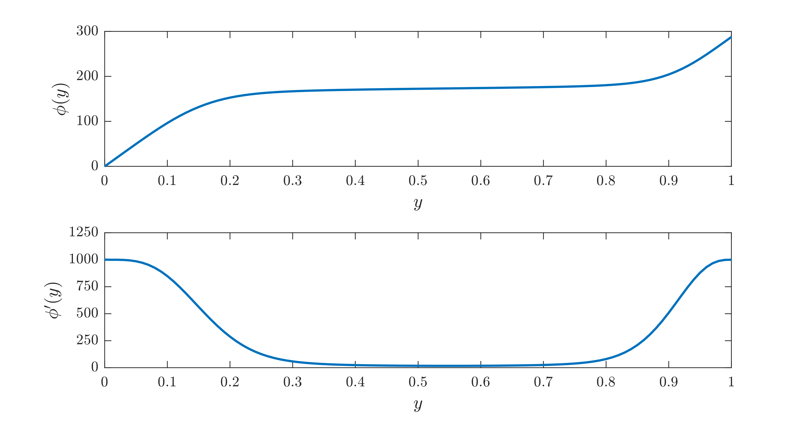

Bounds on energy dissipation for a stress-driven shear flow
============================================================

As in the previous example, consider an idealized two-dimensional layer of fluid, periodic in the horizontal (:math:`x`) direction with period :math:`\Lambda`, bounded below (:math:`y=0`) by a solid wall, and driven at the surface (:math:`y=1`) by a shear stress of non-dimensional magnitude :math:`G` (known as the *Grashoff number*).

Suppose that we can find a *background field* :math:`\varphi(y)` that satisfies the boundary conditions

.. math::

    \begin{aligned}
    \varphi(0)&=0, & \varphi'(1)&=G.
    \end{aligned}

and such that the integral constraint

.. math::

    \begin{aligned}
    \int_0^1 &\left\{
        \frac{1}{k_n^2}\left[ \vert u''(y) \vert^2 + \vert v''(y) \vert^2\right]
        +2 \left[ \vert u'(y) \vert^2 + \vert v'(y) \vert^2\right]
        \right.
        \\
        &\qquad\qquad\qquad
        \left.
        + k_n^2 \left[ \vert u(y) \vert^2 + \vert w(y) \vert^2\right]
        - \frac{2}{k_n}\,\varphi'(y) \left[ u(y)\,v'(y) - v(y)\,u'(y) \right]
    \right\} {\rm d}y \geq 0
    \end{aligned}

holds for all wavenumbers :math:`k_n` and all functions :math:`u(v)` and :math:`v(y)` that satisfy the boundary conditions

.. math::

    \begin{aligned}
    u(0) &= 0, & u(1) &= 0, & u'(0)&=0, & u''(1) &= 0,\\
    v(0) &= 0, & v(1) &= 0, & v'(0)&=0, & v''(1) &= 0.\\
    \end{aligned}

Then, the time-averaged bulk energy dissipation coefficient :math:`C_\varepsilon` can be bounded according to

.. math::

    C_\varepsilon \leq G \times \left[ 2\varphi(1) - \int_0^1 \vert \varphi'(y) \vert^2 \,{\rm d}y \right]^{-2}.

For more details, see e.g. `Fantuzzi & Wynn, Phys. Rev. E 93(4), 043308 (2016) <https://dx.doi.org/10.1103/PhysRevE.93.043308>`_.

This example shows how QUINOPT can be used to construt a polynomial background field :math:`\varphi(y)` to maximize

.. math::

    \mathcal{B}(\varphi) = 2\varphi(1) - \int_0^1 \vert \varphi'(y) \vert^2 \,{\rm d}y,

and thereby minimize the bound on the time-averaged bulk energy dissipation, when :math:`G=1000` and :math:`\Lambda=2`. For simplicity, we assume that it suffices to check the integral inequality constraint for :math:`k_1=2\pi/\Lambda=\pi`. The aim of the example is to illustrate how constraints on the optimization variables can be specified in addition to integral inequality constraints.

:download:`Download the MATLAB file for this example <./example07.m>`

----------------------------------------------
1. Define the problem variables
----------------------------------------------
We begin by clearing the workspace and defining the problem parameters.

.. code-block:: matlabsession

    >> clear
    >> yalmip clear
    >> quinopt clear
    >> lambda = 2;
    >> G = 1000;

Then, we define the independent and dependent variables with the commands

.. code-block:: matlabsession

    >> y = indvar(0,1);
    >> [u,v] = depvar(y);

Then, we construct the polynomial background field :math:`\varphi(y)`. We will take :math:`\varphi(y)` to have degree 20. Since QUINOPT represents polynomials in the Legendre basis internally, we define :math:`\varphi(y)` in the Legendre basis directly using the command ``legpoly()``.

.. code-block:: matlabsession

    >> phi = legpoly(y,20);

Moreover, the integral inequality constraint depends on the first derivative of :math:`\varphi(y)`. This is easily found using the function ``jacobian()``:

.. code-block:: matlabsession

    >> D1phi = jacobian(phi,y);

Finally, we need to specify the boundary conditions on the background field, :math:`\varphi(0)=0` and :math:`\varphi'(1)=G`. These can be specified in a vector of constraints like any standard YALMIP constraint, and the boundary values :math:`\varphi(0)` and :math:`\varphi'(1)` can be accessed using the function ``legpolyval()``:

.. code-block:: matlabsession

    >> CNSTR(1) = legpolyval(phi,0)==0;              % \phi(0)=0
    >> CNSTR(2) = legpolyval(D1phi,1)==G;            % \phi'(1)=G

----------------------------------------------
2. Set up the optimization problem
----------------------------------------------
The integral inequality constraint can be set up, as usual, by defining its integrand and the boundary conditions on the dependent variables:

.. code-block:: matlabsession

    >> k = pi;
    >> EXPR = ( u(y,2)^2+v(y,2)^2 )/k^2 + 2*( u(y,1)^2+v(y,1)^2 ) + k^2*( u(y)^2+v(y)^2 ) - 2*D1phi/k*( u(y)*v(y,1) - u(y,1)*v(y) );
    >> BC = [u(0); u(1); u(0,1); u(1,2)];        % boundary conditions on u
    >> BC = [BC; v(0); v(1); v(0,1); v(1,2)];    % boundary conditions on v

The objective function :math:`\mathcal{B}(\varphi)`, to be maximised, can be set up using the command ``legpolyint()`` to compute the boundary value :math:`\varphi(1)`, and the command ``int()`` to integrate the square of :math:`\varphi'(y)` over :math:`[0,1]`:

.. code-block:: matlabsession

    >> OBJ = 2*legpolyval(phi,1) - int(D1phi^2,y,0,1)/G;

------------------------------------------------
3. Solve and plot the optimal :math:`\varphi(y)`
------------------------------------------------
Having defined all variables and constraints, we can maximize the objective function ``OBJ`` using the syntax

.. code-block:: matlabsession

    >> quinopt(EXPR,BC,-OBJ,[],CNSTR)

.. note::

    The first two arguments specify the integral inequality constraint, while the additional constraints are specified in the fifth argument ``CNSTR``. The fourth argument specifies QUINOPT's options, and here it is left empty to use the default options. Finally, note the minus sign in the objective function, which is needed because QUINOPT minimizes the specified objective function by default.

Once the problem is (successfully) solved, we can compute the upper bound on the dissipation coefficient :math:`C_\varepsilon` with

.. code-block:: matlabsession

    >> UB = G/(value(OBJ))^2;

to find :math:`C_\varepsilon \leq 7.48\times 10^{-3}` approximately. Finally, we can plot the optimal background field :math:`\varphi(y)` and its first derivative using the command ``plot()``, which is overloaded on polynomials defined using the function ``legpoly()``:

.. code-block:: matlabsession

    >> subplot(2,1,1)
    >> plot(0:0.01:1,phi,'-','LineWidth',1.5);
    >> subplot(2,1,2)
    >> plot(0:0.01:1,D1phi,'-','LineWidth',1.5);

This produces the figure below; note that the boundary conditions :math:`\varphi(0)=0` and :math:`\varphi'(1)=G\,(=1000)` are indeed satisfied.

`Back to Table of Contents <http://quinopt.readthedocs.io/>`_
